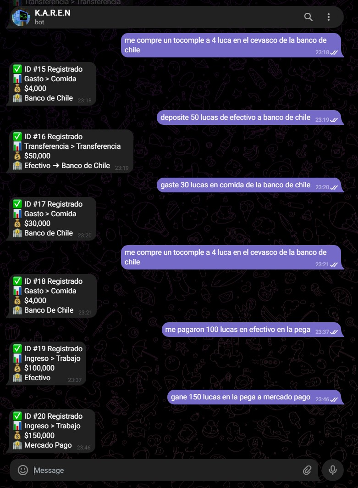
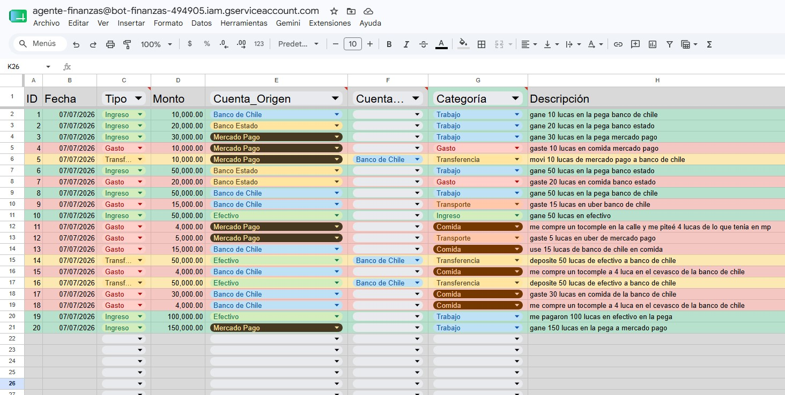
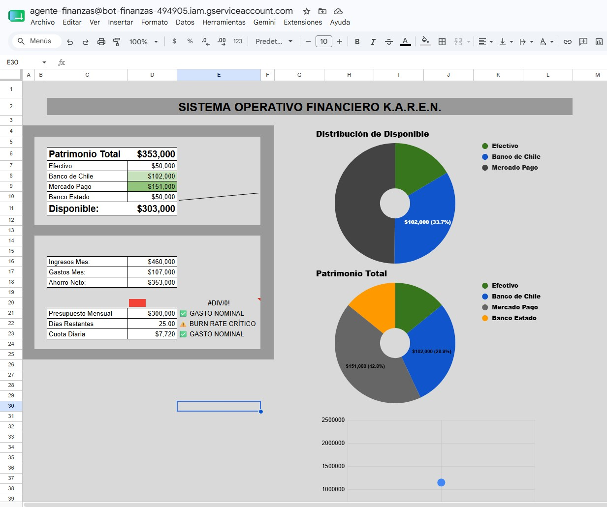

# K.A.R.E.N. | Sistema Operativo Financiero
Bot transaccional desarrollado en Python que automatiza el registro y categorización de gastos mediante Inteligencia Artificial Generativa.

## Arquitectura
El sistema utiliza la API de Telegram como interfaz de usuario, procesa el lenguaje natural desestructurado mediante **Gemini 2.5 Flash** (forzando una salida JSON estructurada) y persiste los datos en un dashboard de **Google Sheets** vía Google Cloud API.

## Interfaz y Flujo de Trabajo

**1. Interfaz de Telegram:**
El usuario envía transacciones en lenguaje natural, usando jerga o montos sin formato. El modelo extrae, categoriza y devuelve un resumen estructurado.

**2. Persistencia en Base de Datos (Google Sheets):**
El backend formatea el JSON extraído por el LLM y lo inyecta como una fila estructurada en tiempo real.

**3. Visualización y Métricas:**
Los datos crudos alimentan un Dashboard automatizado que renderiza el estado del patrimonio, gastos mensuales y distribución de capital.

## Tecnologías Clave
* **Backend:** Python 3, `python-telegram-bot`
* **Procesamiento NLP:** Google Generative AI (Gemini SDK)
* **Base de Datos / UI:** Google Sheets API (`gspread`, `oauth2client`)

## Funcionalidades
* Parseo de jerga chilena y texto no estructurado ("lucas", "mp", errores tipográficos).
* Auto-categorización lógica mediante *prompt engineering* estricto.
* Prevención de errores con bloqueos `try/except` y *fallbacks* para las respuestas del LLM.
* Comandos de rollback (`/borrar`) y consulta de estado (`/saldo`).

## Instalación Local
1. Clonar el repositorio.
2. Configurar entorno virtual: `python -m venv venv` y activar.
3. Instalar dependencias: `pip install -r requirements.txt`.
4. Configurar el archivo `.env` con los tokens de Telegram y Gemini.
5. Inyectar `credentials.json` para la Service Account de Google Cloud.
6. Ejecutar `python main.py`.